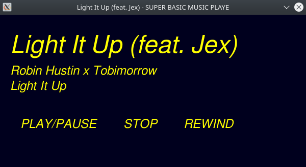

# SuperBasicMusicPlayer



A WIP music player for Linux (originally launched via terminal). This code was initially made in few hours out of boredom while I was without internet connection, purely based on other projects I have made. I added and changed some things later on.

## How does it work?

You must pass a song file through command line or dragging and dropping the file. It can play Vorbis (.ogg), MP3 and FLAC.

## Issues (to be fixed)

Unclean code. Untested using libraries already on the system. Cannot play Opus and other music formats. Wasn't made to run on Windows nor MacOS X (might run if you fix the dependencies, but no guarantees).

## Dependencies

SDL2 version 2.24.0; SDL2_ttf version 2.20.1; SDL_mixer version 2.6.2;
If your system doesn't have any of this (like me, who uses Debian 11 stable so they are decades behind), please build SuperBasicMusicPlayer using shipped static libraries.

## How can I build it?

Build using Premake (at least version 4, untested on Premake 5). There are 4 build options (build and release, using static libraries or installed ones).
If you want to use GNU Make, you can use `make help` to show build options.
Example:
```
premake4 gmake
make config=releasestatic

```

## License

This project is under GNU GPL v3-or-later. Shipped libraries (SDL and related) are under Zlib license. The font is part of GNU FreeFont project and is under GNU GPL 3-or-later with Font-exception2.0
